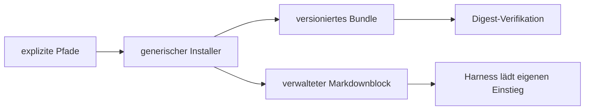

# Agent Governance

[](VERSION) [](CHANGELOG.md)

## Was ist agent-governance?

`agent-governance` ist ein harness- und providerneutrales Rulebook mit einem globalen,
adapterlosen Installer. Das Bundle definiert Regeln, Rollen, Templates, Source-of-Truth-Verträge,
Tool-Routing und Verifikation. Der Installer bindet dieses Bundle über genau einen verwalteten
Markdownblock an einen ausdrücklich angegebenen globalen Einstieg.

Die normative Governance liegt ausschließlich in `bundle/`. Ihr Einstieg ist
`bundle/GOVERNANCE.md`; `bundle/agent-governance/manifest.toml` ist der Root-Index. README,
Installationsdokumentation und der erzeugte Block sind keine zweite Governancequelle.

## Welches Problem löst es?

Agent-Harnesses verwenden unterschiedliche globale Markdowndateien. Eine interne Harnessmatrix
würde Produktwissen, Pfadannahmen und Sicherheitslogik koppeln. Der Installer verarbeitet deshalb
nur explizite Dateisystem- und Governanceverträge: absoluter Zielroot, relative Markdowndatei,
absoluter Installationsroot und globaler Scope.

Er installiert keine Modelle, Provider oder Agenten. Er verändert keine MCP-Konfiguration,
Hooks oder Auto-Approvals und verspricht keine universelle Pre-Effect-Durchsetzung.

Die folgende Grafik ist eine nicht normative Erklärung. Technische Source of Truth bleiben das
Bundle, der getestete CLI-Vertrag und das Releaseinventar.


## Architektur

Die Architekturkennung lautet `GLOBAL_EXPLICIT_PATH_MANAGED_BLOCK`.



Der Installer besitzt keine Harnesserkennung, keine Agent-ID, keine Harnessadapter, keine
harnessspezifischen Parser und keine Runtime-Abhängigkeiten. Die aktive Struktur ist symlinkfrei:

```text
<installation-root>/
├── releases/<version>/bundle/
├── bindings/<binding-id>/current.json
├── bindings/<binding-id>/last-transaction.json
└── backups/<binding-id>/<transaction-id>/
```

Die normative Einstiegskette im Bundle bleibt:

```text
bundle/GOVERNANCE.md
└── bundle/agent-governance/manifest.toml
    ├── catalogs/triggers.toml
    ├── catalogs/policy-tags.toml
    ├── catalogs/scopes.toml
    ├── catalogs/tools.toml
    ├── modules/*.md
    ├── roles/*.md
    └── local_rules (optional und privat)
```

`manifest.toml` ist der Root-Index. Die Kataloge und `modules/tool-routing.md` bleiben die
geschlossenen Routingquellen. Die nächste schematische Darstellung ist ebenfalls nicht normativ.

<details>
<summary>Technischen Governance-Ablauf als Grafik anzeigen</summary>


</details>

## Schnellstart

Für den Release Candidate wird der öffentliche Dist-Tag `next` verwendet. Zielroot und Entrydatei
müssen bewusst gewählt werden:

```sh
npx @tomtastisch/agent-governance@next plan \
  --scope global \
  --installation-root "$HOME/.agent-governance" \
  --target-root "/absoluter/zielroot" \
  --entry-file "EINSTIEG.md" \
  --non-interactive --json

npx @tomtastisch/agent-governance@next install \
  --scope global \
  --installation-root "$HOME/.agent-governance" \
  --target-root "/absoluter/zielroot" \
  --entry-file "EINSTIEG.md" \
  --non-interactive --json
```

Vor einem veröffentlichten RC sind diese Befehle nur der vorgesehene Vertrag, keine Behauptung
einer bereits erfolgreichen Registry-Ausführung.

## CLI- und Managed-Block-Vertrag

Die Commands sind `inspect`, `plan`, `install`, `verify`, `status`, `update`, `uninstall` und
`rollback`. Verbindlich sind `--scope global`, `--installation-root`, `--target-root` und
`--entry-file`. Optional sind `--local-rules`, `--dry-run`, `--json` und `--non-interactive`.
Es gibt kein Defaultziel und keinen stillen Fallback auf das aktuelle Arbeitsverzeichnis.

Der Installer verwaltet exakt einen Block:

```text
<!-- BEGIN AGENT_GOVERNANCE_MANAGED_V1 -->
[deterministische Governanceprojektion]
<!-- END AGENT_GOVERNANCE_MANAGED_V1 -->
```

Außenbytes bleiben einschließlich eines vorhandenen UTF-8-BOM bytegetreu erhalten. Vorhandene LF-
oder CRLF-Zeilenenden werden beibehalten; eine neue Datei entsteht als UTF-8 ohne BOM mit LF. Doppelte, unvollständige, fremde und manipulierte
Marker scheitern fail-closed. Der Block nennt Version, absoluten Installationsroot, normativen
Einstieg, Manifest, Governance-, Manifest- und vollständigen Bundledigest, Ladepflicht, Trennung lokaler Regeln und
Fail-closed-Verhalten. Er ist eine reproduzierbare Projektion, kein normativer Vertrag.

JSON verwendet Schema 1 mit geschlossenem Command-, Outcome-, State-, Phasen-, Rollback- und
Capabilitymodell. Zustände sind `FRESH`, `CURRENT`, `OUTDATED`, `DOWNGRADE_BLOCKED`, `ABSENT`,
`TAMPERED` und `RECOVERY_REQUIRED`. Exitcodes sind 0 (Erfolg), 2 (ungültiger Aufruf), 4
(unsicherer Zustand), 5 (Fehler mit erfolgreichem Rollback), 6 (Rollbackfehler), 130 (`SIGINT`)
und 143 (`SIGTERM`).

## Transaktion, Update und Recovery

Vor der ersten produktiven Mutation schreibt der Installer ein bytegetreues Backup und prüft es
per Readback. Er inventarisiert das komplette normative Bundle, prüft Digests, Größen,
Dateitypen, Traversal und Symlinks und aktiviert erst nach erfolgreichem Staging. Ziel-,
Entry-Parent- und Installationsroot-Identitäten werden vor kritischen Mutationen erneut geprüft.

Update akzeptiert einen gültigen älteren Stand (`OUTDATED`) sowie bei `CURRENT` ausschließlich
den expliziten Austausch lokaler Regeln; auf `FRESH` oder `ABSENT` installiert `update` nicht. Ein Downgrade bleibt ohne
separaten expliziten Vertrag `DOWNGRADE_BLOCKED`. Lokale Regeln werden beim Versionswechsel
erhalten oder nur aus einer neu angegebenen Quelle ersetzt. Uninstall entfernt ausschließlich den
eigenen Block und die targetgebundene `current.json`. Rollback stellt Entry, Metadaten und betroffene lokale Regeln aus
dem letzten verifizierten Receipt wieder her.

Jedes explizite Paar aus Target-Root und Entry-Datei erhält eine deterministische Binding-ID und
damit unabhängige Current-/Receipt-Metadaten im gemeinsamen Installationsroot. Beide Receiptkopien
sind im stabilen Zustand bytegleich. Ein Write-Abbruch zwischen den beiden atomaren Statuswechseln wird nur für die
write-order-konformen benachbarten Zustände und bei identischen unveränderlichen Feldern als `RECOVERY_REQUIRED`
akzeptiert. Receipts wechseln geschlossen zwischen `PREPARED`, `COMMITTED` und `ROLLED_BACK`. Ein
`PREPARED`-Zustand blockiert weitere Mutationen bis zum expliziten Rollback. Mutationen desselben
Installationsroots sind durch einen ownergebundenen fail-closed Root-Lock gegenseitig ausgeschlossen;
Rollback darf einen geschlossen validierten Lock eines nachweislich nicht mehr lebenden Prozesses atomar übernehmen. Rollback entfernt
keinen Release und setzt keine lokalen Regeln zurück, solange eine andere aktive Bindung diesen Shared
State referenziert. Receiptgebundene Digests, kanonische Backup-Ahnen und vollständige Vorprüfung
schützen Entry, Current-Metadaten und lokale Regeln vor partieller oder veralteter Wiederherstellung; jede Ressource
wird unmittelbar vor und nach ihrem Restore erneut geprüft. Das erste von
`SIGINT` oder `SIGTERM` wird gelatcht und führt zu genau einem Rollback. `SIGKILL`, Stromausfall
und Dateisystemdefekte sind nicht vollständig atomar abfangbar; dafür bleibt der Recoveryzustand
fail-closed sichtbar.

## Lokale persönliche Regeln

`--local-rules` erwartet eine explizite absolute, kanonische, reguläre Markdown-Nicht-Symlink-Datei
mit gültigem UTF-8; von rohen C0-/DEL-Kontrollzeichen sind nur TAB, LF und CR zulässig. Bereits
installierte Regeln werden bei Status, Verify und Übernahme erneut gegen diesen Vertrag geprüft.
Das Ziel wird ausschließlich aus `local_rules` in `bundle/agent-governance/manifest.toml` abgeleitet.
Die private Quelldatei wird nicht committed und nicht in das öffentliche Releaseartefakt
aufgenommen. Ausgaben enthalten weder Inhalt noch Fragmente, keine Hashes, Größen, Zeilenzahlen
oder andere Fingerprints dieser Regeln.

## Dokumentierte Harnessrezepte

Die folgenden Rezepte beruhen auf aktueller offizieller Dokumentation (geprüft am 24.08.2026).
Sie sind Dokumentation und E2E-Fixtures, keine Runtime-Presets oder Harnesslogik. Vor jeder Nutzung
sind vorhandene Overrides und der tatsächlich aktive Profil-/Workspacepfad zu inventarisieren.

Codex liest global `AGENTS.md` aus dem Codex-Home, standardmäßig `$HOME/.codex`; ein vorhandenes
`AGENTS.override.md` hat Vorrang. Quelle: [offizielle OpenAI-Dokumentation](https://developers.openai.com/codex/guides/agents-md).

```sh
npx @tomtastisch/agent-governance@1.0.0 install --scope global --installation-root "$HOME/.agent-governance" --target-root "$HOME/.codex" --entry-file AGENTS.md --non-interactive
```

Claude Code dokumentiert persönliche Instruktionen unter `$HOME/.claude/CLAUDE.md`. Quelle:
[Claude Code Docs](https://code.claude.com/docs/en/memory).

```sh
npx @tomtastisch/agent-governance@1.0.0 install --scope global --installation-root "$HOME/.agent-governance" --target-root "$HOME/.claude" --entry-file CLAUDE.md --non-interactive
```

OpenCode V2 lädt global `$XDG_CONFIG_HOME/opencode/AGENTS.md`, normalerweise
`$HOME/.config/opencode/AGENTS.md`. Quelle: [OpenCode V2 Instructions](https://opencode.ai/v2/docs/instructions).

```sh
npx @tomtastisch/agent-governance@1.0.0 install --scope global --installation-root "$HOME/.agent-governance" --target-root "$HOME/.config/opencode" --entry-file AGENTS.md --non-interactive
```

OpenClaw lädt `AGENTS.md` aus dem aktiven Workspace. Der Default ist
`$HOME/.openclaw/workspace`, kann aber durch Profil, State-Directory, Environment oder
Agentkonfiguration abweichen. Quelle: [OpenClaw Agent Workspace](https://docs.openclaw.ai/concepts/agent-workspace).

```sh
npx @tomtastisch/agent-governance@1.0.0 install --scope global --installation-root "$HOME/.agent-governance" --target-root "$HOME/.openclaw/workspace" --entry-file AGENTS.md --non-interactive
```

Das OpenClaw-Rezept ist nur für den nachweislich aktiven Default-Workspace zulässig; andernfalls
muss `--target-root` auf den verifizierten aktiven Workspace zeigen.

## Capability- und Kompatibilitätsstatus

Lokale Dateisystemtests dürfen `FILESYSTEM_INSTALLED`, `BINDING_MATERIALIZED`, `DIGEST_VERIFIED`
und `ROLLBACK_AVAILABLE` belegen. `HARNESS_E2E_VERIFIED` verlangt zusätzlich eine tatsächlich
neu gestartete Sitzung, die Entry-Laden, Root- und Manifestauflösung, synthetische lokale Regeln,
Legacyfreiheit und fail-closed manipulierte oder fehlende Governance prüft.

Für den noch unveröffentlichten RC wurde bislang keine öffentliche Fresh Session ausgeführt.
Codex, Claude Code, OpenCode und OpenClaw sind daher in diesem Stand nur dokumentierte Rezepte;
kein Harness trägt bereits `HARNESS_E2E_VERIFIED`.

## Migration von v0.5.0

Die Migration ist bewusst nicht automatisch. Zuerst werden aktive Bindings und persönliche
Regeln inventarisiert und bytegetreu gesichert. Danach folgen Stable-Installer-Dry-Run,
Installation mit expliziten Pfaden, Fresh Session, Legacyfreiheitsprüfung sowie Update-,
Uninstall- und Rollbackprobe. Produktive Migration ist erst aus dem öffentlich verifizierten
Stable-Paket zulässig.

Der unveröffentlichte Codex-only-Entwurf 0.6.0 wurde aus Runtime und öffentlichem Paket entfernt:
kein `--harness`, keine festen Codexpfade, keine Hooks und keine MCP-Mutation. Der
Fremdadapteraudit schloss unter anderem `skills`, `add-mcp`, `ruler` und `rulesync` wegen fehlender
globaler Bindungsfähigkeit oder nicht akzeptabler Supply-Chain-Eigenschaften aus. Es gibt keine
Fremdadapterdependency.

## Releaseprozess

Der erste öffentliche Kandidat ist `1.0.0-rc.1` unter `next`. Nach Registry-Readback,
Provenanceprüfung, öffentlicher Fresh-Installation, kompletter Harnessmatrix und offenen-fundfreiem
QA-/Security-Review kann ein separater Promotion-PR `1.0.0` unter `latest` freigeben. Jede
notwendige öffentliche Vertragsänderung erzeugt stattdessen einen weiteren RC.

Tags und Releases müssen auf dem geprüften Exact Head liegen und repositorykonform signiert sein.
Der main-kontrollierte Workflow `.github/workflows/npm-publish.yml` verifiziert zuerst Tag,
Signatur, Version und Dist-Tag, baut am signierten Tag neu und veröffentlicht über npm Trusted
Publishing mit OIDC. Danach prüft er Registry-Metadaten, Dist-Tag, SLSA-Provenance und
Paketsignaturen. Fehlt die externe npm-Trust-Konfiguration, bleibt der Publishschritt blockiert.
Ein lokaler Branch ist kein Release.

## Verifikation und Tests

Die lokalen Gates umfassen:

```sh
npm ci --ignore-scripts
npm run typecheck
npm run lint
npm run build
npm test
npm run pack:check
python3 -m unittest discover -s tests -v
python3 tools/release_check.py tree
python3 tools/release_manifest.py check
tests/e2e/run_installer_fixture.sh
git diff --check
```

CI führt Paketgates mit Node 24 und 26 auf macOS und Linux aus. Das Paket besitzt keine
Runtime-Abhängigkeiten; Tarball-Allowlist, lokale Tarballinstallation, `npx`, `pnpm dlx`, Audit,
Lizenz- und Secretprüfungen gehören vor Veröffentlichung zur Releaseevidenz. Unabhängige
read-only QA- und Security-Reviews müssen denselben Exact Head bewerten.

## Security- und Betriebsgrenzen

Bedrohungsmodell sind manipulierte Bundles, Traversal, Symlinkumleitung, Rootaustausch zwischen
Inspektion und Mutation, beschädigte Marker, unterbrochene Transaktionen und private Daten in
Logs. Abwehr sind geschlossenes Inventar, Digest- und Typprüfung, kanonische explizite Pfade,
Identity-Rechecks, Backup-Readback, atomare Dateiwechsel, geschlossene Receipts und fail-closed
Zustände.

Der Installer ist kein Paketmanager für andere Software, kein Credential Service, keine Control
Plane und kein Enforcementprovider. Er nimmt keine Secrets als CLI-Argumente an. Authentifizierung
für GitHub oder npm wird nicht simuliert und darf nicht in Ausgaben oder Repositoryartefakte
gelangen.

## Bekannte Einschränkungen

- Die Markdownbindung ist Instruktionskontext, keine technische Erzwingung jeder Toolwirkung.
- Atomare Renames beseitigen nicht alle Host-Dateisystem- oder privilegierten Angreiferrennen.
- Rollback arbeitet auf dem letzten geschlossenen Receipt; ältere Backups werden nicht implizit
  ausgewählt.
- `bindings/<binding-id>/current.json` ist die symlinkfreie, explizit targetgebundene
  Aktivierungsmetadatei; ein `current`-Symlink wird nicht erzeugt.
- Unbekannte Dateiformate, Projektinstallation und implizite globale Ziele sind nicht unterstützt.
- Eine dokumentierte Rezeptdatei ohne reale Fresh Session begründet keine Harnesskompatibilität.

## Support

Wenn dir das Projekt hilft und du Danke sagen möchtest, kannst du mich mit einem Kaffee
unterstützen.

[](https://buymeacoffee.com/tomtastisch)
