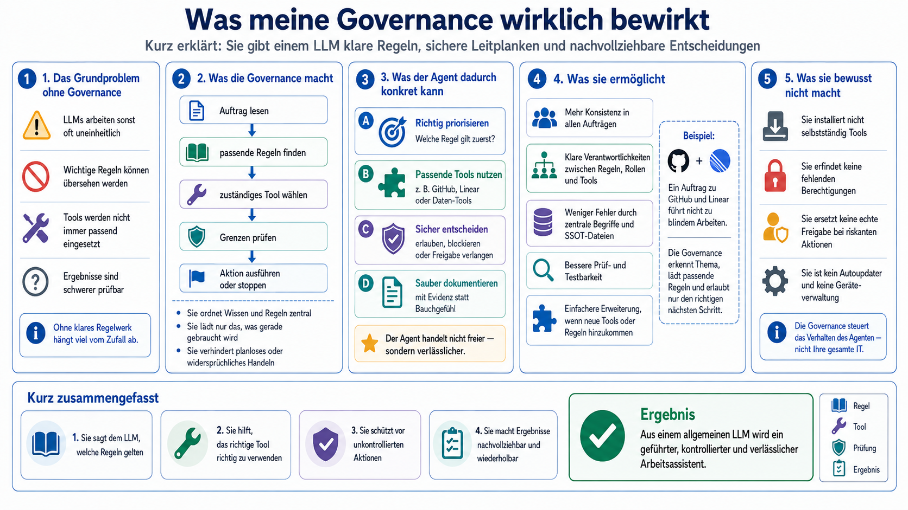
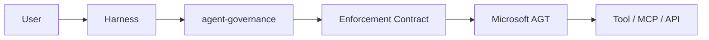
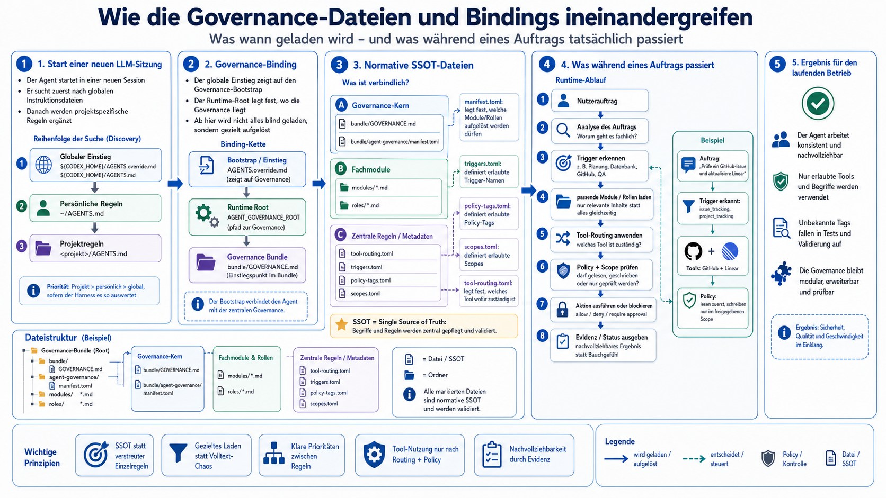
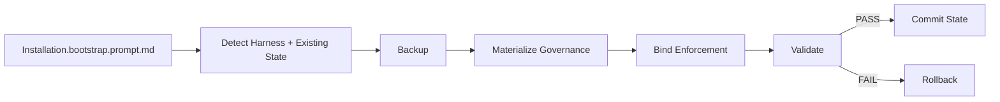

# Agent Governance

[](VERSION) [](CHANGELOG.md)

## Was ist agent-governance?

`agent-governance` ist ein kompaktes, harness- und providerneutrales Rulebook für Agenten. Es
definiert Regeln, Rollen, Templates, Source-of-Truth-Verträge, Tool-Routing und Verifikation. Die
normative Governance liegt ausschließlich unter `bundle/`; Dokumentation, Bootstrap, Tests und
Integrationen außerhalb dieses Verzeichnisses sind Distribution oder technische Consumer.

Der einzige kanonische Governance-Einstieg ist `bundle/GOVERNANCE.md`.
`bundle/agent-governance/manifest.toml` bleibt der Root-Index: Es referenziert die vier
geschlossenen Kataloge sowie Module und Rollen. Unbekannte oder mehrdeutige Klassifikationen und
unbekannte Katalogreferenzen blockieren nur die betroffene Wirkung.

## Welches Problem löst es?

Agent-Harnesses unterscheiden sich bei globalen Instruktionen, Konfiguration und Toolzugriff.
Ohne eine klare Grenze können Projekttexte, Providerverfügbarkeit oder nachträgliche Prüfungen
fälschlich als Autorisierung verstanden werden. Dieses Repository trennt deshalb drei Aufgaben:

- Die Governance entscheidet semantisch, was zulässig ist und welche QA-, SEC- und Evidenzregeln
  gelten.
- Der generische Enforcement Contract normalisiert eine bereits autorisierte Aktion und eine
  Providerentscheidung.
- Ein konkreter Provider kann eine Aktion vor dem Effekt weiter einschränken, aber nie erlauben,
  was die Governance abgelehnt hat.

### Was die Governance bewirkt

Die folgende Grafik ist eine nicht normative Erklärung für den fachlichen Einstieg. Die
technischen Sources of Truth bleiben der Bootstrap, das Manifest und die Katalogdateien unter
`bundle/`.



## Architektur



Die normative Einstiegskette bleibt klein:

```text
bundle/GOVERNANCE.md
└── bundle/agent-governance/manifest.toml
    ├── catalogs/triggers.toml
    ├── catalogs/policy-tags.toml
    ├── catalogs/scopes.toml
    ├── catalogs/tools.toml
    ├── modules/*.md
    ├── roles/*.md
    └── local_rules (optional, privat und unversioniert)
```

`manifest.toml` ist der Root-Index. `catalogs/triggers.toml` definiert die erlaubten Trigger,
`catalogs/policy-tags.toml` die erlaubten Wirkungsklassen, `catalogs/scopes.toml` die erlaubten
Ressourcenklassen und `catalogs/tools.toml` die Tool-Routing-SSOT.
`modules/tool-routing.md` enthält ausschließlich die allgemeinen Routing-, Evidenz- und
Autorisierungsgrenzen.

Die folgende schematische, nicht normative Darstellung erklärt den grundlegenden Ablauf. Sie
enthält vereinfachte Bezeichnungen aus einer früheren Entwurfsphase und ist keine exakte
Dateikarte; für technische Pfade sind ausschließlich die aktuellen normativen Pfade oben und das
Manifest maßgeblich.

<details>
<summary>Technischen Governance-Ablauf als Grafik anzeigen</summary>



</details>

Repository-Dateien außerhalb `bundle/` werden von dieser Kette nicht als Governance geladen.
Insbesondere ist der vendorte Microsoft-Snapshot untrusted Dependency-Datenmaterial.

## Governance und Enforcement

Governance ist die semantische Autorität für Instruktionsgrenzen, Task-Klassifikation, Routing,
Rollen, Autorisierung, Toolauswahl, Reviews, QA, SEC, Evidenz und Abschlussstatus. Der generische
Vertrag in `bundle/agent-governance/modules/enforcement.md` erhält eine kleine Action Envelope mit
Action-/Evidence-ID, Aktion, Ressource, Effekt, semantischer Autorisierung sowie Approval- und
Risikokontext.

Die normalisierte Providerentscheidung ist genau `allow`, `deny`, `require_approval`, `error`
oder `unknown`. Governance-`deny` erreicht den Provider nicht als erweiterbare Erlaubnis.
Provider-`deny`, fehlende Approval-Evidenz sowie `error` und `unknown` blockieren fail-closed.
Nur `allow` darf eine bereits semantisch autorisierte Aktion fortsetzen. Enforcement findet vor
dem relevanten Effekt statt; eine nachträgliche Prüfung genügt nicht.

## Schnellstart

1. Verwende einen veröffentlichten `agent-governance`-Release.
2. Gib deinem Agenten `Installation.bootstrap.prompt.md` aus diesem Release.
3. Der Agent erkennt Harness und bestehenden Installationszustand und führt die sichere Transaktion aus.
4. Prüfe den ausgegebenen Installations-/Migrations- und Verifikationsstatus.
5. Starte danach eine neue Agentensitzung.

Für Mitarbeiter sind keine internen Paketpfade oder Microsoft-SDK-Schritte erforderlich. Der
Bootstrapvertrag übernimmt Erkennung, Backup, Materialisierung, Binding, Verifikation und bei
Fehlern den Rollback innerhalb des ausdrücklich autorisierten Zielsystems.

## Installation und erster Start

`Installation.bootstrap.prompt.md` ist der einmalige ausführbare Installations-, Integrations-
und Migrationsvertrag. Er erkennt den tatsächlichen persistenten globalen Instruktionsmechanismus,
absolute Zielpfade und eine synchrone Pre-Effect-Schnittstelle. Er setzt keinen Benutzernamen,
kein Homeverzeichnis und keinen Produktpfad voraus. Das generische Rootkonzept ist
`AGENT_GOVERNANCE_ROOT`; `CODEX_HOME` ist nur nach realer Codex-Erkennung ein möglicher
Harnesskandidat.

Ab 0.6.0 führt das paketierte CLI diesen Vertrag deterministisch aus. Ein produktiver Aufruf
verlangt explizite absolute Wurzeln und unterstützt ausschließlich Codex:

```text
npx agent-governance@0.6.0 plan --harness codex --home <codex-home> --allowed-root <root> --release-root <release> --install-root <ziel> --json
npx agent-governance@0.6.0 install --harness codex --home <codex-home> --allowed-root <root> --release-root <release> --install-root <ziel> --json
```

`inspect`, `verify`, `rollback` und `status` verwenden dieselben expliziten Grenzen. `--dry-run`
verändert keine produktiven Ziele. OpenCode, Claude Code und andere Harnesses werden als nicht
unterstützt abgelehnt; dieser Auftrag veröffentlicht das Paket nicht in einer Registry.

Vor jeder Mutation inventarisiert und sichert der Agent die betroffenen Ziele außerhalb aktiver
Instruktionsnamen, verifiziert das Backup, bereitet Governance und Provider in einer
Stagingwurzel vor und aktiviert den Zustand erst danach. Relative Roots, Rootkonflikte,
Pfadtraversal, unerwartete Symlinks und unklare verlustfreie Regelmigration blockieren.



## Fresh, Current und Legacy

- **Fresh:** Kein Governancezustand ist vorhanden. Der Bootstrap materialisiert Release,
  kanonischen Einstieg und Provider, bindet den Harness und prüft eine frische Session.
- **Current:** Die aktuelle Bundle-Struktur bleibt unangetastet. Eine vollständig passende
  Wiederholung erzeugt keine Mutation; fehlende Bindings werden gezielt repariert, ohne Bundle
  oder lokale Regeln neu zu schreiben.
- **Legacy:** Historische aktive Verzeichnis- oder Harnessverdrahtungen werden inventarisiert und
  gesichert. Synthetisch und real vorhandene persönliche Regeln werden nur bei eindeutiger
  verlustfreier Zuordnung an den Manifestpfad überführt; alte aktive Imports werden erst nach
  erfolgreicher neuer Materialisierung entfernt. Jeder Verifikationsfehler führt zum Rollback.

Der Referenztest verwendet ausschließlich isolierte synthetische Fixtures. Dieser Releaseauftrag
verändert keine bestehende Benutzerinstallation.

## Nutzung

Eine neue Agentensitzung lädt den byte-identischen Einstieg, löst genau einen absoluten
Governance-Root auf, liest den vollständigen Manifestindex und die vier dort referenzierten
Kataloge und klassifiziert den Auftrag gegen den geschlossenen Triggerkatalog. Danach lädt sie nur
die getroffenen Module samt Abhängigkeiten und gegebenenfalls genau die ausgelöste Rolle. Für
enforcement-pflichtige Wirkungen wird die Action Envelope synchron vor dem Effekt bewertet.

Status- oder Abschlussaussagen müssen die tatsächlich ausgeführten Prüfungen, den geprüften Stand
und verbleibende Risiken nennen. Tool- oder Providerverfügbarkeit ist nie selbst eine
Berechtigung.

## Routing und Rollen

`manifest.toml` ist der statische Root-Index. Die geschlossene Klassifikation liegt ausschließlich
in `catalogs/triggers.toml`; jedes Modul deklariert im Manifest Pfad, Trigger und Abhängigkeiten.
Abhängigkeiten werden topologisch vor dem Modul geladen. Rollen besitzen eigene Rollentrigger und
laden nur die im Manifest angegebenen Module und ihren Rollenpfad.

Toolprofile und ihre `required_on`-/`useful_on`-Zuordnung liegen ausschließlich in
`catalogs/tools.toml`. Policy-Tags beschreiben mögliche Lese- oder Schreibwirkung, Scopes die
betroffene Ressourcenklasse. Weder beide noch ein Tool oder Provider erzeugen konkrete
Autorisierung. Allgemeine Semantik wie Read before Write, fachlich gleichwertige Fallbacks und
fail-closed unbekannte IDs bleibt in `modules/tool-routing.md`.

Die enthaltenen Rollen decken Architektur, Triage, Quality Assurance und Security Review ab.
Rollen sind semantische Reviewkontexte; GitHub-, Copilot- oder Security-Werkzeuge sind mögliche
Provider und keine Rollenautorität.

## Lokale persönliche Regeln

Der optionale Pfad wird ausschließlich aus dem Manifestwert `local_rules` in
`bundle/agent-governance/manifest.toml` abgeleitet und nicht hardcodiert. Die echte Datei ist
durch `.gitignore` geschützt, bleibt private Hostdaten und wird nicht committed oder in
Releaseartefakte kopiert. Logs und Reports enthalten weder Regeltext noch Fragmente, keine Hashes,
Größen, Zeilenzahlen oder andere Fingerprints. Lokale Gleichheitsprüfungen berichten nur Boolean-
Ergebnisse.

Harness-native Startup Instructions und Governance-gesteuertes Runtime-Laden sind verschieden.
Bei Codex kann `codex debug prompt-input` native Quellen diagnostizieren, ist aber für den
`local_rules`-Runtimepfad nicht ausreichend. Dieser Nachweis benötigt eine frische isolierte
`codex exec`-Sitzung mit synthetischen, nichtprivaten Regeln, die den Einstieg, das Manifest und
den Manifestpfad read-only verarbeitet.

## Module und Rollen erweitern

Neue normative Regeln gehören in genau ein geeignetes Modul unter
`bundle/agent-governance/modules/`. Neue Trigger werden einmal in `catalogs/triggers.toml`
definiert und anschließend im statischen Manifestindex referenziert; Modulabhängigkeiten bleiben
minimal. Neue Rollen liegen unter `bundle/agent-governance/roles/` und dürfen nur von ihrem eigenen
Rollentrigger geladen werden. Neue Toolprofile gehören ausschließlich in `catalogs/tools.toml`
und dürfen nur vorhandene Trigger-, Policy-Tag- und Scope-IDs referenzieren.

Vor einer Änderung sind SSOT, Linkziele, eindeutige Regelkennungen, Modulabschluss und die
Fail-closed-Klassifikation durch die vollständige Testsuite zu prüfen. Dokumentation außerhalb
des Bundles darf den normativen Vertrag beschreiben, aber keine zweite Regelquelle bilden.

## Microsoft-AGT-Integration

Microsoft Agent Governance Toolkit ist ausschließlich der konkrete primäre Enforcement-Provider
und keine Governance-Quelle, Rollenmodell, Installationsautorität, Control Plane oder Updater.
Dieser Release pinnt das neueste zur Materialisierung bestimmte stabile offizielle GitHub Release
`v4.1.0` auf Commit `0de71ca6c95cf8b9b975ac96f48eaa7826bbe258`. Der offizielle Upstreamstatus
lautet **Public Preview**; daraus folgt keine Zertifizierung oder Unterstützung dieses Projekts
durch Microsoft.

Das vollständige offizielle Releasearchiv liegt byte-identisch im Repository. Lock,
Archiv-SHA-256, vollständiges Dateimanifest, MIT-Lizenz, NOTICE und Trademark-Hinweis sichern die
Provenienz. Der Snapshot wird nur beim einmaligen Bootstrap lokal geprüft, linkfrei extrahiert und
gebaut; normaler Betrieb lädt nichts von GitHub, Microsoft, npm oder einem `latest`-Kanal nach.

Für den gepinnten Upstream existiert kein offizieller Codex-Adapter. Die kleine eigene Bridge basiert
auf dem offiziellen Framework Adapter Contract und normalisiert Action Envelope und Entscheidung.
Der Codex-Hook vermittelt ausschließlich einen explizit konfigurierten Toolpfad. Das Tool liefert
nur eine kanonische Operation und eine begrenzte Resource-ID; Action, Effekt, semantische
Autorisierung, Risiko, Action-ID und Evidence-ID leitet der Hook aus einem hashgebundenen
Operationsvertrag beziehungsweise aus der Harness-Tool-ID ab. Caller-Attestierungen dieser
Sicherheitsfelder und ungeprüfte Approval-IDs werden nicht akzeptiert. Eine vollständige
Interception beliebiger Shell- oder Hosted-Tool-Semantik wird nicht behauptet.

## Verifikation und Tests

Die lokale Basissuite lautet:

```text
python3 -m unittest discover -s tests -v
python3 tools/release_check.py tree
git diff --check
```

Sie prüft Governance-SSOT und Routing, geschlossene Katalogschemen und Referenzen, sichere
manifestrelative Katalogpfade, den generischen Enforcement Contract, Microsoft-Pin und
Archivgrenzen, reale PolicyEngine-Entscheidungen, Fresh-/Current-/Legacy-Transaktionen,
Backup/Rollback, Pfadsicherheit, einen produktneutralen synthetischen Harness, `local_rules` und
Offlinebetrieb. Der Releaseprozess ergänzt Clean-Linux-Codex-E2E, Secret-Isolation, unabhängige
Exact-Head-QA, separate SEC, blockierende GitHub Actions und Post-Release-Tests vom Tag.

Unterstützung wird nur für tatsächlich verifizierte Flächen behauptet. Der synthetische neutrale
Harness ist deterministisch geprüft. Clean-Linux-E2E verifiziert den Bootstrap, frische Runtime-
Sessions, synthetische `local_rules` und reale Providerblockaden mit **Codex CLI 0.147.0**. Andere
Codex-Versionen sind dadurch nicht automatisch abgedeckt. Der Containerbuild bindet Basisimage,
Debian-Snapshot, direkte Paketversionen und den npm-Lock; der Runner akzeptiert nur einen exakten
signaturgeprüften Commit. `CURRENT` und `LEGACY` werden als ausdrücklich benannte synthetische
Containerfixtures geprüft. Eine zweite Session startet den tatsächlich materialisierten
Microsoft-Provider mit deaktiviertem Netzwerk und prüft Governance, Manifest, `local_rules`,
Routing, `allow`, `deny`, `require_approval` und lokales Audit erneut.

## Versionierung

`VERSION` ist die einzige SemVer-Quelle. `CHANGELOG.md` trennt freigegebene von noch nicht
freigegebenen Änderungen, README verweist nur auf `VERSION`, und der Releasecheck gleicht Tree,
Tag und GitHub Release ab. Version `0.5.0` ersetzt die externe Governance-Tool-ID breaking durch
`agent_governance__execute`, weil Codex `mcp` und `mcp__*` für native MCP-Namensräume reserviert.
Es gibt keinen Alias für die frühere ID. Provider, Hook und Consumer verwenden weiterhin denselben
Governance-Handler und dieselbe SSOT. Die davon getrennte Manifest-Schemaversion bleibt `2`.

Ein Branch, PR oder lokaler Teststand ist kein Release. Produktionsfreigabe setzt die Gleichheit
von Main-, Tag-, Release-, QA-, SEC-, CI-, E2E- und Post-Release-SHA voraus.

## Security- und Betriebsgrenzen

Der Bootstrap darf nur auf einem konkret autorisierten Zielsystem mutieren. Er ist kein
Paketmanager, Hintergrundmonitor, Telemetriebackend, Credential Service, Deploymentwerkzeug oder
Fleet-/Cloud-Control-Plane. Microsoft-Upgrades erfordern einen neuen separat autorisierten
`agent-governance`-Release.

Private Regeln und Authdaten gelangen nicht in Repository, Image, Logs oder Reports. Auth für
echte Container-E2E wird ausschließlich ephemer zur Laufzeit, mit Verzeichnisrechten `0700` und
Dateirechten `0600`, bereitgestellt und danach entfernt. Providerfehler, fehlende synchrone
Interception, Approval-Lücken sowie unsichere Pfade blockieren fail-closed.
Providerbuild und Laufzeit akzeptieren einen vorhandenen Runtimebaum nur bei exaktem Vollmanifest;
Policy- und Modulbytes werden über sichere Handles gegen releasegebundene Digests geprüft.
Scheitert ein Rollback selbst, bleiben das verifizierte Recovery-Backup und ein recoverbarer
Altzustand erhalten, statt sie im Fehlerpfad zu löschen.

## Bekannte Einschränkungen

- Produktiv unterstützt ist in 0.6.0 ausschließlich Codex. Die Fixturematrix läuft auf Linux und
  macOS; die credentialgebundene Fresh-Session-Evidenz bleibt auf Codex CLI 0.147.0 unter Linux
  begrenzt.
- Der synchrone Schutz gilt für das explizit gebundene Dynamic Tool
  `agent_governance__execute`. Beliebige Shell-, Hosted-Tool- oder andere Harnesswirkungen werden
  nicht als universell intercepted behauptet.
- Die Installation ändert keine MCP-Konfiguration und aktiviert keine MCP-Auto-Approvals.

- Microsoft Agent Governance Toolkit und seine Frameworkschnittstellen befinden sich im Status
  Public Preview.
- Es gibt keinen offiziellen Codex-Adapter. Die eigene Bridge deckt nur den ausdrücklich
  operationsgebundenen Pre-Effect-Toolpfad ab. Neue reale Toolwirkungen benötigen eine eigene
  vertrauenswürdige Abbildung von Operation und Ressource; der Aufrufer darf diese Semantik nicht
  selbst attestieren.
- Die Clean-Linux-Probes verwenden `danger-full-access` ausschließlich innerhalb eines bereits
  isolierten, nichtprivilegierten Testcontainers, weil eine verschachtelte Bubblewrap-Sandbox in
  diesem Containerkontext nicht verfügbar ist. Der äußere Container behält Standard-Seccomp,
  AppArmor und null zusätzliche Capabilities; der Test belegt nicht die verschachtelte Codex-
  Sandbox selbst.
- Andere reale Harnesses als die im jeweiligen Release ausdrücklich verifizierten werden nicht
  als unterstützt behauptet; der neutrale Harness beweist Portabilität des Vertrags, nicht eine
  konkrete Produktintegration.
- Installation benötigt einmalig die im Release festgestellten lokalen Build-Runtimes. Nach
  erfolgreichem Bootstrap arbeitet Governance und Providerinitialisierung offline.
- Enforcementdateien benötigen eine Harness-/Betriebsgrenze, die unautorisierte Änderungen an
  Hook, Operationsvertrag, Policy und Provider-Runtime verhindert. Erkennt die Integritätsprüfung
  eine Abweichung, wird fail-closed blockiert; sie ersetzt keine Host-Dateiberechtigungen.
- Dieses Repository enthält keine Control Plane, keinen automatischen Updater und kein
  Credential Management.

## Support

Wenn dir das Projekt hilft und du Danke sagen möchtest, kannst du mich mit einem Kaffee
unterstützen.

[](https://buymeacoffee.com/tomtastisch)
