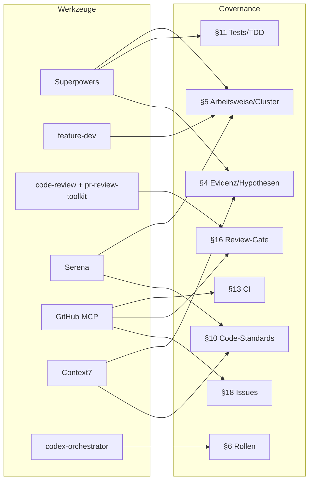

# Werkzeug-Katalog (Kern §19)

Einzige autoritative Quelle (SSOT) für empfohlene Konnektoren, MCP-Server, Plugins und Skills.
Diese Datei ersetzt das frühere `tools.toml` — sie ist zugleich Maschinen-Referenz für den
Installations-Agenten (er liest Markdown nativ) und lesbarer Katalog für Menschen. Die
deterministische CLI-Installation bleibt im `Brewfile`; dieser Katalog beschreibt das Warum, den
Nutzen für die Governance und den Installationsweg je Werkzeug.

Zwei Freigabe-Ebenen (Kern §7, §19):
- Als „Standard-Setup" markierte Werkzeuge sind für das Regelwerk erforderlich und dürfen
  anlassbezogen ohne Rückfrage nachinstalliert werden (Dauerfreigabe Kern §7).
- Als „Optional empfohlen" markierte Werkzeuge sind nützlich, aber nicht erforderlich. Vor ihrer
  Installation holt der Agent eine ausdrückliche Freigabe ein — einmalig bei der Ersteinrichtung
  des Harness, nicht je Session (Kern §19). Die Entscheidung wird im Profil (`[PROFILE:prefs]`)
  vermerkt und nicht erneut erfragt.

## Warum Werkzeuge — und warum diese

Das Regelwerk verlangt belegte Arbeit statt Raten: verifizierter IST-Zustand (§3.6), Evidenz je
Behauptung (§4), keine erfundenen APIs (§4, §10), unabhängige Rollen (§6), aktive CI- und
Review-Gates (§13, §16) und lückenlose Issue-Dokumentation (§18). Genau diese Pflichten sind mit
den passenden Werkzeugen billiger und zuverlässiger einzuhalten als von Hand — deshalb gilt
MCP-first (§19): erst ein etabliertes Werkzeug, dann Eigenbau. Der Katalog ist bewusst klein und
kuratiert; jedes Werkzeug bezahlt seinen Platz durch eine konkrete Governance-Pflicht, die es
erfüllt. Werkzeuge ersetzen keine Kernpflicht — sie helfen, sie auszuführen (Adapter-Hinweis).



## Strukturierte Workflows und Rollen

### Superpowers
*Standard-Setup (Claude Code).* Erzwingt strukturierte Entwicklungs-Workflows: testgetriebene
Entwicklung, systematisches Debugging, Code-Review, Umsetzungsplanung und parallele Aufgaben mit
Verifikations-Checkpoints. Die Skills bringen genau die Kadenz mit, die der Kern in §5 (planen,
in Slices umsetzen, je Teilaufgabe verifizieren) und §4 (hypothesengetriebenes Arbeiten) fordert.
Nutzen für die Governance: macht §5, §11 (TDD) und §4 aus einer Konvention zu einem geführten,
schwer umgehbaren Ablauf.

```
https://github.com/obra/superpowers
```

### feature-dev
*Optional empfohlen (Claude Code).* Geführter Ablauf für die Feature-Entwicklung von der Planung
bis zur verifizierten Umsetzung, passend zur iterativen Arbeitsweise und zur Cluster-Planung. Er
strukturiert das Zerlegen in Teilaufgaben und Cluster (§5.2) und die Checkpoint-Disziplin (§5.5).
Nutzen für die Governance: senkt die Reibung, Aufgaben regelkonform in prüfbare Einheiten zu
schneiden.

```
/plugin install feature-dev@claude-plugins-official
```

### codex-orchestrator
*Optional empfohlen (Codex).* MCP-Server zur Orchestrierung unabhängiger Rollenläufe unter Codex;
vom Codex-Adapter als möglicher `roles.mechanism` referenziert. Er hilft, für AK/ST/QA/SEC je einen
sauberen, chatfreien Kontext zu erzeugen, wie §6 ihn verlangt. Nutzen für die Governance: liefert
den vom Kern geforderten unabhängigen Rollenkontext, statt Rollen im Executor-Kontext zu simulieren
(unzulässig nach §6).

```
# ~/.codex/config.toml
[mcp_servers.codex-orchestrator]
# Befehl/Bezug laut Codex-MCP-Konfiguration eintragen
```

## Code-Verständnis und Navigation

### Serena
*Standard-Setup (MCP; Claude Code, Codex und weitere).* Coding-Agent-Toolkit mit semantischer
Code-Suche und -Bearbeitung auf Symbolebene über Language-Server (LSP) statt reiner Textsuche.
Gerade in größeren Codebasen findet und ändert der Agent damit gezielt Symbole, Aufrufer und
Verträge, statt zu raten. Nutzen für die Governance: stützt den verifizierten IST-Zustand (§3.6),
das Verstehen betroffener Module (§5.1) und die repo-weiten Konsistenz-/Drift-Audits der AK-Rolle
(§9), und arbeitet dabei tokensparend.

```
https://github.com/oraios/serena
```

## Git, Pull Requests, CI und Review

### GitHub MCP Server
*Standard-Setup (MCP; harness-übergreifend).* Offizieller GitHub-MCP-Server; verbindet den Agenten
direkt mit Issues, Pull Requests, Commits, Check-Runs und Reviews per strukturierten Aufrufen statt
brüchiger Shell-Skripte. Deckt die Aktionen ab, die der Kern ohnehin verlangt: PR bei Auftragsstart
und Cluster-Pushes (§15), CI-Prüfpflicht je Push (§13), Review-Threads am Exact Head (§16) und
Issue-Dokumentation (§18). Nutzen für die Governance: macht die PR-, CI- und Review-Gates
zuverlässig und nachweisbar bedienbar.

```
https://github.com/github/github-mcp-server
```

### code-review und pr-review-toolkit
*Standard-Setup (Claude Code).* Zwei zusammengehörige Plugins für strukturiertes Diff-Review:
Findings mit Datei/Zeile, Schweregrad und Reproduktion sowie PR-Review-Threads. Sie unterstützen den
QA-Alternativpfad und die laufende Cluster-QA (§5.5, §16.3), bei denen jedes Finding als eigener
ungelöster Review-Thread verlangt wird (§16.4). Nutzen für die Governance: liefert die Form von
Review-Evidenz, die das Merge-Gate akzeptiert — nicht bloß Chat-Zusammenfassungen.

```
/plugin install code-review@claude-plugins-official
/plugin install pr-review-toolkit@claude-plugins-official
```

## Aktuelle Dokumentation (Anti-Halluzination)

### Context7
*Optional empfohlen (MCP; harness-übergreifend).* Holt aktuelle, versionsgenaue Bibliotheks- und
Framework-Dokumentation direkt in den Kontext des Agenten, statt sich auf möglicherweise veraltetes
Trainingswissen zu verlassen. Damit sinkt das Risiko erfundener oder überholter APIs deutlich.
Nutzen für die Governance: dient direkt der Belegpflicht (§4) und korrekten, vollständig validierten
Schnittstellen (§10) — eine autoritative Quelle statt einer Vermutung.

```
https://github.com/upstash/context7
```

## CLI-Grundwerkzeuge

Standard-Setup (erforderlich): `git`, `gh`, `jq` — Basis für Versionskontrolle, GitHub-CLI-Zugriffe
und JSON-Verarbeitung. Deterministisch über das erforderliche `Brewfile` (installiert ausschließlich
diese Pflichtwerkzeuge):

```
brew bundle --file=tools/Brewfile
```

Optional empfohlen: `gum` (Terminal-Progress) und `shellcheck` (Shell-Linting, stützt §11). Sie
stehen bewusst in einem separaten Brewfile und werden erst nach Freigabe (Kern §19) installiert,
damit der Standard-Pfad keine freigabepflichtigen Werkzeuge mitzieht:

```
brew bundle --file=tools/Brewfile.optional
```

## Installations- und Freigabe-Hinweise

- Claude-Code-Plugins über den Plugin-Manager (`/plugin`) bzw. `/plugin install <name>@<markt>`;
  Aktivierung persistent in `~/.claude/settings.json` unter `enabledPlugins`. Dokumentation:
  <https://code.claude.com/docs/en/discover-plugins>.
- MCP-Server je Harness konfigurieren: Claude Code über die MCP-Konfiguration, Codex über
  `~/.codex/config.toml` unter `[mcp_servers]`.
- Erstinstallation optionaler Werkzeuge nur nach ausdrücklicher Freigabe (Kern §19); die Antwort
  wird im Profil vermerkt und nicht wiederholt erfragt.
